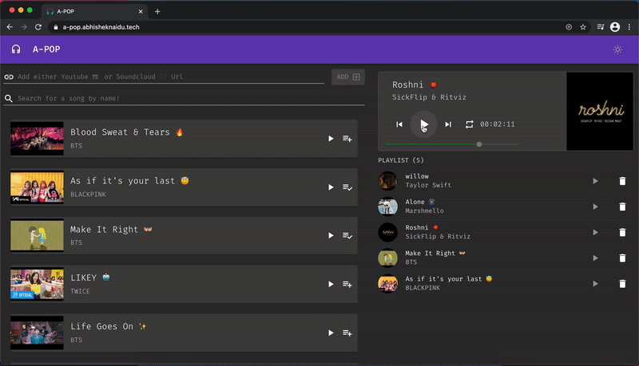

<h1 align="center"> A-POP 🎶 </h1>

[](https://github.com/dwyl/esta/issues)

[](https://github.com/abhisheknaiidu/a-pop/actions?workflow=Prettier)
[](https://github.com/abhisheknaiidu/a-pop/actions?workflow=ESLint)
[](https://github.com/abhisheknaiidu/a-pop/issues)
[](https://github.com/abhisheknaiidu/a-pop/pulls)
[](https://github.com/abhisheknaiidu/a-pop)
[](https://github.com/abhisheknaiidu/a-pop/fork)

[A-POP](https://a-pop.abhisheknaidu.tech/) is a HD Music Stream and Sharing Application 🎧 built in order to provide high sound clarity for Youtube or SoundCloud Songs and without ads and even video streaming!

**Just Music and Chill** 😉

It's actually a hack for students, to listen to songs and bgm's from Youtube without even buffering data for video streams and also can share with friends.

## Table of Contents

- [Demo](#demo)
- [Technology Stack](#technology-stack)
- [Installation & Usage](#installation-&-usage)
- [Testing](#testing)

## Demo

View the application at [a-pop](https://a-pop.abhisheknaidu.tech/)

<hr>

<div align="center">

 </img>

</div>

API is being hosted on Heroku using Apollo Client!

## Technology Stack


It is built using GraphQL, Apollo Client, Material-UI and obviously React!

| Technology    | Description                               | Link ↘️                                    |
| ------------- | ----------------------------------------- | ------------------------------------------ |
| HTML5         | Hyper Text Markup Language                | ----                                       |
| CSS3          | Cascading Style Sheets                    | ----                                       |
| JavaScript    | High Level, Dynamic, Interpreted Language | ----                                       |
| GraphQL       | Query Language for APIs                   | https://graphql.org                        |
| Apollo Client | State Management Library                  | https://www.apollographql.com/docs/react/g |
| Material UI   | Material UI Framework for React           | https://www.apollographql.com/docs/react/  |

## Installation & Usage

_Ensure [Node.js](https://nodejs.org/en/) and [NPM](https://www.npmjs.com/) are installed_

1. Clone or Download the repository (Depending on whether you are using SSH or HTTPS)

```
git clone git@github.com:abhisheknaiidu/a-pop.git
cd a-pop
```

2. Install dependencies

```
npm i
```

3. Start the application

```
npm start
```

After the application starts visit [http://localhost:3000](http://localhost:3000) to view it in the browser.

## Testing

Run the command `npm test` to run the tests

`npm run build`
